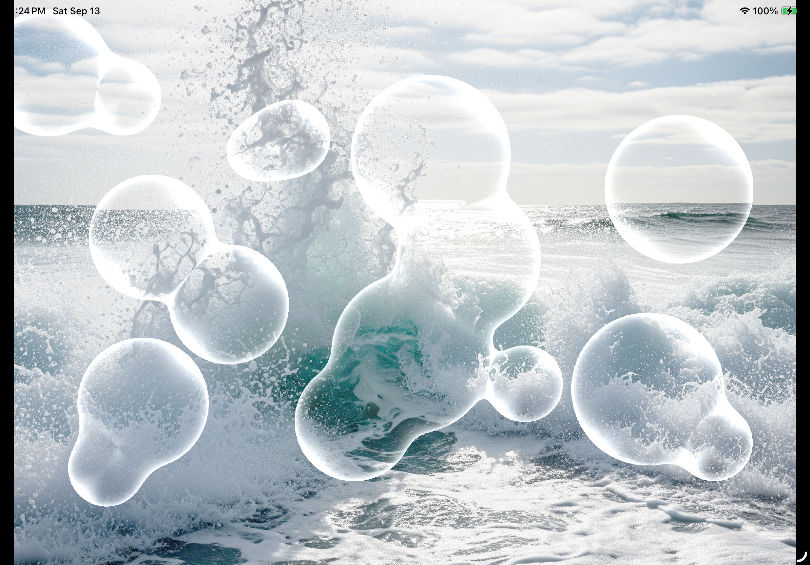

# Simple glass effect Demo

- uses Metal4 API.
- organic shape and vector field generated by 2D SDFs
- SDF grid and gradient computed with compute shaders
- Final rendering using a simple screen size quad and a fragment shader relying on the background image and a packed sdf data (distance, gradient)
- maximum reuse of C++ code shared between CPU (Objective-C++) and GPU (MSL) to share uniforms and enabling step-by-step debugging of shader code on CPU

# Instructions

- double tap anywhere on screen to add a new bubble
- double tap on a bubble to remove it
- drag a bubble to move it around
- pinch a bubble to resize it
